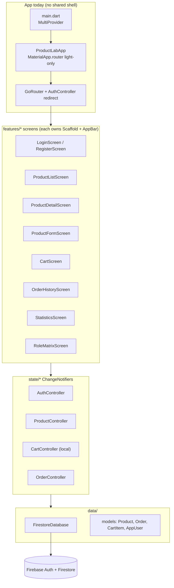
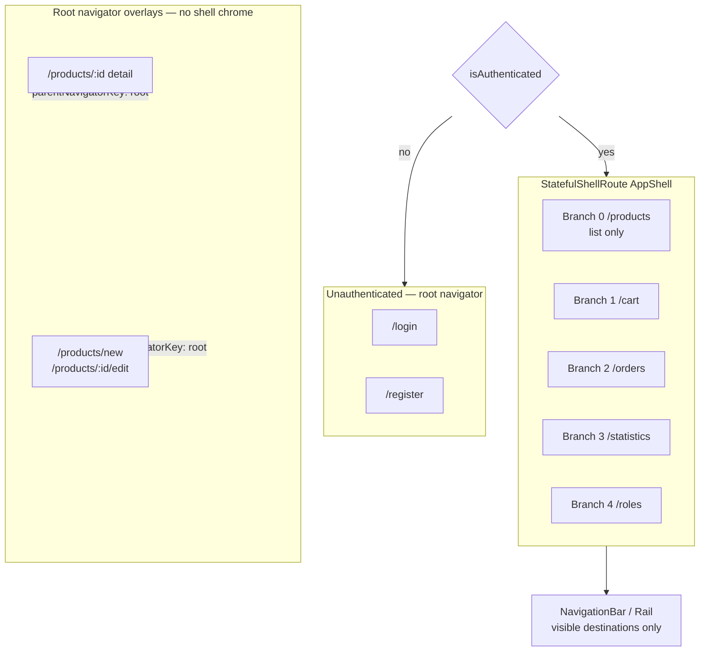
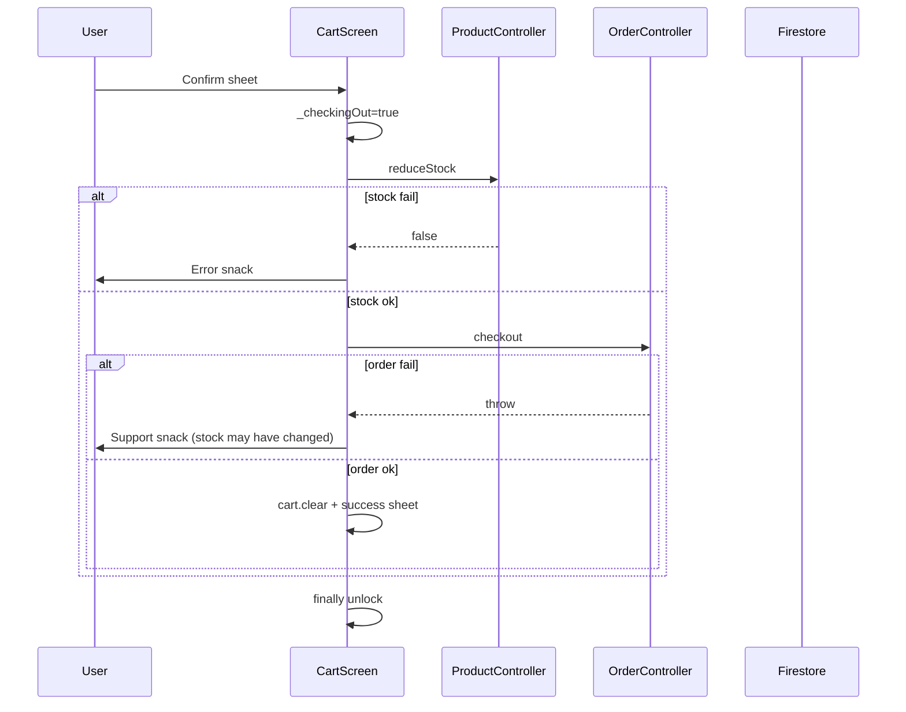
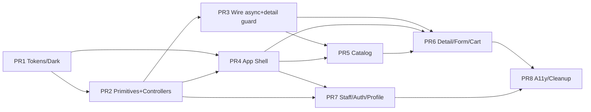

# Premium Mobile UI/UX Overhaul — Product Management Cart App (StoreFlow)

| Field | Value |
| --- | --- |
| **Document title** | Premium Mobile UI/UX Overhaul for StoreFlow |
| **Author** | _TBD / Engineering_ |
| **Date** | 2026-07-20 |
| **Status** | Approved — Ready for Implementation |
| **Revision** | R3 — user open questions resolved (2026-07-20); after R1 Issues 1–18 + R2 nits |
| **Primary platform** | Flutter mobile (phone-first); Android / iOS primary; Web & Windows must not regress |
| **Backend** | Firebase Auth + Cloud Firestore (unchanged) |
| **Codebase root** | `D:\FPT_University_các kì\kì 8\PGM393\product_management_cart_app` |
| **App entry** | `lib/main.dart` → `ProductLabApp` (`lib/app/product_lab_app.dart`) |
| **UI brand** | StoreFlow (Dart type names like `ProductLabApp` remain unchanged) |

---

## Overview

StoreFlow is a Flutter multi-platform product management, cart, and revenue lab app backed by Firebase Auth and Cloud Firestore. The app already has a coherent Material 3 teal/terracotta palette (`lib/core/theme/app_theme.dart`), Vietnamese-first copy, role-aware routing (`lib/app/router.dart`), and functional screens for auth, catalog, cart/checkout, orders, statistics, and RBAC matrix. What it lacks is a **systematic, mobile-first premium design system**: tokenized spacing/type/elevation, a shared app shell with bottom navigation, consistent loading/error/empty patterns, polished micro-interactions, customer-safe product visibility (list **and** deep links), and performance-minded list/image behavior.

This design proposes an **incremental enhancement** of the existing Flutter client—not a rewrite. We extend `AppTheme` into a full design-token layer, introduce a role-aware `AppShell` with nested-Scaffold contract and fixed shell branches, extract reusable premium components, harden async UX around Firestore streams, and polish every critical flow (login → browse → detail → cart/checkout → orders/stats/roles) to feel high-end on phone while remaining usable on tablet/web/desktop.

---

## Background & Motivation

### Current architecture (ground truth)



| Layer | Location | Notes |
| --- | --- | --- |
| Theme | `lib/core/theme/app_theme.dart` | M3 light only; deep teal `#0D5C58`, terracotta `#E07A5F`, sage tertiary; Roboto; card radius 16; filled buttons height 52; several hard-coded `Colors.white` fills |
| Routing | `lib/app/router.dart` | Flat `GoRoute`s; role guards; `/orders` and `/cart` **route-guarded to customers only** (`canShop`); staff blocked and redirected to `/products`; no `StatefulShellRoute` / bottom nav |
| Shared UI | `lib/shared/widgets/` | Only `EmptyState`, `ProductImage`, `SectionHeader` |
| Controllers | `lib/state/*` | Provider + ChangeNotifier; products/orders stream from Firestore; cart is session-local; no load/error flags |
| Legacy | `lib/data/services/local_database.dart` | Hive leftover; **not** wired in `main.dart`; `hive` / `hive_flutter` still in `pubspec.yaml` |
| Product reads | `firestore.rules` | `allow read: if signedIn()` — **all authenticated roles can read drafts/archived** |

### What already works well

- Strong visual direction: role accent colors (`AppRoleX.accentColor`), gradient headers, staggered grid entrance (`_AnimatedEntrance`), cart badge elastic bounce, product detail `SliverAppBar` + `Hero` image, custom bar chart on statistics.
- Vietnamese copy is consistent across screens.
- Checkout uses Firestore transaction stock reduction (`FirestoreDatabase.reduceStock`) then order create.
- Role matrix + router redirects keep Admin/Manager/Customer capability boundaries.
- Staff order/revenue review already lives on Statistics; customer-only `/orders` is intentional route policy (not “missing tab”).

### Pain points & UX gaps

| Gap | Evidence | User impact |
| --- | --- | --- |
| No global app shell / bottom nav | Every secondary screen uses AppBar icon → `context.go(AppRoutes.products)` | Mobile feels like disconnected pages; no thumb-zone primary nav |
| Light theme only + hard-coded whites | `ProductLabApp` light-only; inputs/dialogs use `Colors.white` | No dark mode; dark theme would break without tokenizing fills |
| No stream loading / error UI | Controllers listen without `onError` or loading flags | Blank grid or silent failure on permission/network issues |
| Customers see non-storefront items (list + deep link) | `visibleProducts` no status filter; `findById` returns any product; detail shows any found id | Draft/archived reachable via history/link; list hygiene alone is incomplete |
| Design tokens not codified | Magic numbers duplicated per screen | Inconsistent polish |
| Components private to screens | `_GridTile`, `_CartTile`, `_MiniMetricCard`, etc. | Duplication |
| Image loading basic | `Image.network` without disk/memory cache package | Scroll jank |
| Checkout dialog-only, no in-flight lock | `_checkout` can double-tap race | Double order risk; weak success moment |
| Mock social proof | Detail hardcodes `4.8 · 142 đánh giá` | Undermines premium honesty |
| AppBar action overcrowding | roles/stats/orders/cart/account on product list | Overflow / poor discoverability |
| Dual bottom bars if shell + detail naïvely combined | Detail already has `bottomNavigationBar` CTA | Not premium; must resolve (see §1.3) |
| Accessibility incomplete | 9–10px labels, small 32×32 steppers | WCAG/touch targets uneven |
| Test surface thin | Only `test/cart_controller_test.dart` | Refactors lack safety net |
| Stats filter placement + dataset split | Filter below best-sellers; chart uses full `orders.orders` while metrics use filtered | Confusing staff analytics |

### Demo accounts (unchanged)

| Role | Email | Password |
| --- | --- | --- |
| Admin | `admin@store.local` | `123456` |
| Manager | `manager@store.local` | `123456` |
| Customer | `customer@store.local` | `123456` |
| Edge customer | `edge.customer@store.local` | `123456` |

---

## Goals & Non-Goals

### Goals

1. **Premium mobile-first UX** — phone layouts feel high-end: motion, hierarchy, density, safe areas, thumb zones.
2. **Concrete design system** — color, type, spacing, radius, elevation tokens + component inventory implementable in Flutter.
3. **Role-aware app shell** — bottom navigation (or adaptive NavigationRail on wide) with destinations filtered by capability; explicit Scaffold ownership.
4. **Hardened async UX** — loading skeletons, empty, error, retry for product/order streams.
5. **Customer catalog hygiene** — customers only see **active** storefront products in list **and** on detail deep links; staff keep full inventory + status filters. (UX-only; not a security boundary.)
6. **Screen-by-screen polish** — login, browse, detail, cart/checkout, orders, statistics, role matrix with before/after UX.
7. **Performance** — virtualized lists, image decoding/cache strategy, skeleton loaders, safe optimistic cart interactions.
8. **Incremental delivery** — ordered PRs (~8), each independently reviewable/mergeable, with effort and smoke tests.
9. **Vietnamese-first strings** — keep existing localization approach (inline Vietnamese).

### Non-Goals

- Rewrite app in another framework or greenfield architecture.
- Replace Firebase Auth / Firestore or introduce a custom backend API.
- Cloud Functions, payment gateway, push notifications, real ratings/reviews system.
- Compensating transactions / Cloud Functions for post-`reduceStock` order failures (document UX only).
- Full i18n ARB multi-language package.
- Offline-first Hive cart persistence (cart stays session-local).
- Changing the 3-role RBAC model or tightening Firestore product-read rules (explicitly out of scope; UI filters only).
- Pixel-perfect tablet redesign (only “must not break” adaptive constraints).
- In-app theme toggle (v1 uses `ThemeMode.system` only).
- **Chart libraries** (`fl_chart` or similar) — keep and polish the existing custom statistics bar chart only.

---

## Proposed Design

### 1. Information architecture & navigation

#### 1.1 Role-aware destinations

| Destination | Route | Customer | Manager | Admin |
| --- | --- | --- | --- | --- |
| Cửa hàng / Kho | `/products` | ✅ label: Cửa hàng | ✅ label: Kho hàng | ✅ label: Kho hàng |
| Giỏ hàng | `/cart` | ✅ | ❌ | ❌ |
| Đơn hàng | `/orders` | ✅ | ❌ | ❌ |
| Thống kê | `/statistics` | ❌ | ✅ | ✅ |
| Phân quyền | `/roles` | ❌ | ❌ | ✅ |
| Tài khoản (sheet) | — | ✅ | ✅ | ✅ |

**Staff orders policy (explicit):** `/orders` and `/cart` remain **route-guarded to customers only** (existing `canShop` redirects). Staff do **not** get an “Đơn” tab. Staff review orders only via **Statistics** order list (all orders stream when `canViewRevenue`). This matches current router behavior and is preserved—not a UX regression.

Account (logout, role badge) moves from crowded AppBar icons into a `ProfileSheet` opened from a trailing AppBar avatar on primary tabs (not a sixth bottom destination).

#### 1.2 Shell architecture

Introduce `StatefulShellRoute.indexedStack` wrapping authenticated branches so tab state is preserved.



**Files:**

- New: `lib/shared/shell/app_shell.dart`
- New: `lib/shared/shell/shell_destinations.dart`
- Change: `lib/app/router.dart`

**Adaptive layout:**

| Width | Pattern |
| --- | --- |
| `< 600` | Material 3 `NavigationBar` (default height/indicator — **do not hardcode height**) |
| `≥ 600` | `NavigationRail` + content |
| `≥ 1024` | Optional extended rail; content max width 1200 centered |

#### 1.2.1 Scaffold ownership contract (critical)

| Layer | Owns | Does **not** own |
| --- | --- | --- |
| **`AppShell`** | Outer `Scaffold` with `body: navigationShell` and `bottomNavigationBar` **or** `NavigationRail` in a `Row`. Adaptive layout only. | AppBars, FABs, per-screen `bottomNavigationBar` CTAs, drawers |
| **Branch screens** (list, cart, orders, stats, roles) | Their **own nested `Scaffold`** with `AppBar` / `SliverAppBar`, `body`, optional `floatingActionButton`, optional screen-level bottom bar (cart total, etc.) | Global tab bar |
| **Immersive root routes** (product form; product detail — see §1.3) | Full-screen `Scaffold` on **root** navigator; no shell chrome | Shell nav |

**Nested Scaffold is intentional (Material-supported):** outer shell provides tab chrome; inner provides app bar and FAB. This avoids rewriting every screen into body-only widgets in one PR.

**`extendBody`:** set `AppShell` `extendBody: true` only if a screen needs content under a transparent nav; default **false**. Staff product FAB sits above nav via inner Scaffold FAB + bottom content padding (`AppSpacing.xxxl` or `kBottomNavigationBarHeight` equivalent padding on scroll views)—not by fighting two FABs.

**SnackBar / ScaffoldMessenger host:**

- Prefer the **nearest** Scaffold (inner). Existing `ScaffoldMessenger.of(context).showSnackBar` from feature screens continues to work with nested Scaffolds.
- Avoid showing SnackBars from shell-level code unless using root messenger; do not introduce a second global messenger.
- Modal bottom sheets for checkout use their own context; success sheet is independent of inner Scaffold.

**AppBar actions after shell lands:**

| Screen | Keep | Remove (moved to shell/profile) |
| --- | --- | --- |
| Product list | Title; optional search in body; Profile avatar → sheet | Role matrix, statistics, orders, cart icon buttons (tabs/badge cover these) |
| Cart | Title; clear-all | Storefront back icon (use shell tab) |
| Orders | Title | Storefront icon |
| Statistics | Title | Storefront icon |
| Roles | Title | Storefront icon |
| Product detail (root) | Back/close; staff edit/delete | N/A |
| Product form (root) | Close; save is body CTA | N/A |

#### 1.2.2 Fixed branch table & navigator keys

**Global keys** (declared once in `router.dart` or a small `app_navigator_keys.dart`):

```dart
final GlobalKey<NavigatorState> rootNavigatorKey = GlobalKey<NavigatorState>();
// Optional per-branch keys if needed for nested pops; indexedStack works without them initially.
```

**Fixed branch order** (never reorder per role):

| `branchIndex` | Path | Screen | Capability to **show** in nav |
| --- | --- | --- | --- |
| 0 | `/products` | `ProductListScreen` (+ nested detail **not** — detail is root; see §1.3) | Always (authenticated) |
| 1 | `/cart` | `CartScreen` | `user.canShop` |
| 2 | `/orders` | `OrderHistoryScreen` | `user.canShop` |
| 3 | `/statistics` | `StatisticsScreen` | `user.canViewRevenue` |
| 4 | `/roles` | `RoleMatrixScreen` | `user.canViewRoleMatrix` |

**IndexedStack behavior:** all five branches remain mounted under the shell. At lab scale (tiny state) this is acceptable and preserves tab state. Document memory cost as negligible for this app.

**Visible destination mapping** (prevents index mismatch):

```dart
// shell_destinations.dart
class ShellDestination {
  const ShellDestination({
    required this.branchIndex,
    required this.label,
    required this.icon,
    required this.selectedIcon,
  });
  final int branchIndex; // FIXED index into StatefulNavigationShell
  final String label;
  final IconData icon;
  final IconData selectedIcon;
}

List<ShellDestination> destinationsFor(AppUser user) {
  final all = <ShellDestination>[
    ShellDestination(
      branchIndex: 0,
      label: user.canManageProducts ? 'Kho hàng' : 'Cửa hàng',
      icon: Icons.storefront_outlined,
      selectedIcon: Icons.storefront,
    ),
    if (user.canShop)
      const ShellDestination(
        branchIndex: 1,
        label: 'Giỏ',
        icon: Icons.shopping_bag_outlined,
        selectedIcon: Icons.shopping_bag,
      ),
    if (user.canShop)
      const ShellDestination(
        branchIndex: 2,
        label: 'Đơn',
        icon: Icons.receipt_long_outlined,
        selectedIcon: Icons.receipt_long,
      ),
    if (user.canViewRevenue)
      const ShellDestination(
        branchIndex: 3,
        label: 'Thống kê',
        icon: Icons.analytics_outlined,
        selectedIcon: Icons.analytics,
      ),
    if (user.canViewRoleMatrix)
      const ShellDestination(
        branchIndex: 4,
        label: 'Quyền',
        icon: Icons.shield_outlined,
        selectedIcon: Icons.shield,
      ),
  ];
  return all;
}
```

**Selected index on NavigationBar** = index into **visible** list, not `navigationShell.currentIndex` raw if that includes hidden branches:

```dart
final visible = destinationsFor(user);
final selected = visible.indexWhere((d) => d.branchIndex == navigationShell.currentIndex);
// if selected < 0 (e.g. deep link edge), clamp to 0 and optionally goBranch(0)

onDestinationSelected: (i) {
  HapticFeedback.selectionClick();
  navigationShell.goBranch(
    visible[i].branchIndex,
    initialLocation: i == selected,
  );
},
```

**Redirect interaction with shell:** keep existing redirect block. Staff deep-link to `/cart` or `/orders` → redirect `/products` **before** shell paints that branch. Customer deep-link to `/statistics` or `/roles` → redirect `/products`. Shell does not replace server/router authorization.

#### 1.3 Secondary navigation — detail vs dual bottom bars (resolved)

**Problem:** `ProductDetailScreen` already uses `Scaffold.bottomNavigationBar` for add-to-cart. Shell also needs a tab bar. Showing both is not premium.

**Decision (closes former Open Question #1):**

| Route | Navigator | Shell nav visible? | Rationale |
| --- | --- | --- | --- |
| Product **detail** `/products/:id` | **Root** (`parentNavigatorKey: rootNavigatorKey`) | **No** | Full-screen immersive; single bottom CTA bar; cart affordance via AppBar `CartBadgeIcon` for shoppers + back |
| Product **form** `/products/new`, `/products/:id/edit` | **Root** | **No** | Modal editing feel; close button; dirty pop guard |
| Product **list** `/products` | Branch 0 | **Yes** | Primary tab |
| Cart / orders / stats / roles | Branches 1–4 | **Yes** | Primary tabs |

**go_router shape (FINAL — flat root siblings):**

Detail and form are **top-level `GoRoute` siblings** of the shell (and of login/register), each with `parentNavigatorKey: rootNavigatorKey`. Do **not** nest them under the shell branch’s `/products` route with selective parent keys. Shell branch 0 exposes **list only**.

```dart
// FINAL: flat root siblings (not shell-nested children)
// Path order: 'new' before ':id' / ':id/edit' as needed for matching

GoRoute(
  path: '/products/new',
  parentNavigatorKey: rootNavigatorKey,
  builder: (_, __) => const ProductFormScreen(),
),
GoRoute(
  path: '/products/:id/edit',
  parentNavigatorKey: rootNavigatorKey,
  builder: (_, state) => ProductFormScreen(productId: state.pathParameters['id']),
),
GoRoute(
  path: '/products/:id',
  parentNavigatorKey: rootNavigatorKey,
  builder: (_, state) => ProductDetailScreen(productId: state.pathParameters['id']!),
),
// StatefulShellRoute branch 0: GoRoute(path: '/products') => ProductListScreen only
```

> Implementation note: with go_router, path ordering matters (`new` before `:id`). Register detail/form as **flat root siblings** with `parentNavigatorKey: rootNavigatorKey` so they cover the shell (no tab bar).
>
> **Hero caveat:** List lives on a **branch** navigator; detail is pushed on the **root** navigator. Flutter Hero flights are scoped per navigator / hero controller by default—matching `tag: 'image-${product.id}'` alone often **does not** animate across shell vs root. Treat continuous Hero as **best-effort**: verify on device in PR4/PR6. **Acceptable fallback:** Material/Cupertino page transition (fade/slide) without Hero, or a shared `heroController` only if product owners insist on flight polish. Dual-bar avoidance (Decision #4) outranks Hero continuity.

**Not chosen:** hide shell nav via `AppShell` path inspection while keeping detail in-branch—possible, but root immersive is clearer, avoids dual bars, and matches “modal form” already desired.

---

### 2. Design system — tokens

#### 2.1 File layout

```
lib/core/theme/
  app_theme.dart          # ThemeData assembly (light + dark)
  app_colors.dart         # Brand + semantic colors
  app_typography.dart     # TextTheme
  app_spacing.dart
  app_radii.dart
  app_elevation.dart
  app_motion.dart
```

#### 2.2 Color tokens

| Token | Light | Dark | Usage |
| --- | --- | --- | --- |
| `brand.primary` | `#0D5C58` | `#3DABA5` | Primary CTA, price, key icons |
| `brand.secondary` | `#E07A5F` | `#F0A08C` | Accent, cart badge |
| `brand.tertiary` | `#2D6A4F` | `#5FA882` | Success-adjacent brand |
| `surface.scaffold` | `#F4F7F6` | `#0F1413` | Scaffold bg |
| `surface.card` | `#FFFFFF` | `#1A2220` | Cards |
| `surface.elevated` | `#FFFFFF` | `#232B29` | Sheets, bottom bars |
| `semantic.success` | `#16A34A` | `#4ADE80` | In stock / completed |
| `semantic.warning` | `#D97706` | `#FBBF24` | Low stock |
| `semantic.error` | `#EF4444` | `#F87171` | Errors / delete |

##### Role accent unification (all three pairs — intentional visual delta)

Today **three** dual sources exist (not only Admin):

| Role | `AppTheme.*Accent` (theme file) | `AppRole.accentColor` (enum) | **Canonical after PR-tokens** |
| --- | --- | --- | --- |
| Admin | `#6366F1` | `#7C3AED` | **`#7C3AED`** (`AppRole`) |
| Manager | `#0D5C58` | `#0F766E` | **`#0F766E`** (`AppRole`) |
| Customer | `#E07A5F` | `#D97706` | **`#D97706`** (`AppRole`) |

**Source of truth:** `AppRoleX.accentColor`. Remove or deprecate `AppTheme.adminAccent` / `managerAccent` / `customerAccent`. Theme imports role colors if needed for demos.

**PR-tokens acceptance:** light mode visual parity for brand primary/secondary/scaffold/cards/buttons; **role chrome (headers, demo panels, role chips) may shift** to enum hexes—call this out in PR description, not a bug.

#### 2.3 Typography scale

Keep `fontFamily: 'Roboto'`.

| Style | Size / Weight | Usage |
| --- | --- | --- |
| `displaySm` | 28 / w900 / -0.5 | Login brand |
| `headlineMd` | 22 / w900 / -0.4 | Screen titles |
| `titleLg` | 18 / w900 / -0.3 | Section titles |
| `titleMd` | 16 / w800 | Card titles |
| `titleSm` | 14 / w800 | List titles |
| `bodyLg` | 15 / w500 / 1.5 | Descriptions |
| `bodyMd` | 14 / w500 | Default body |
| `bodySm` | 12 / w600 | Meta |
| `labelLg` | 13 / w800 | Buttons, chips |
| `labelSm` | 11 / w800 | Badges (floor; replace 9px labels) |
| `price` | 16–20 / w900 / primary | Currency |

**Rule:** no meaningful UI text &lt; **11sp**.

#### 2.4 Spacing scale

```dart
abstract final class AppSpacing {
  static const double xxs = 4;
  static const double xs = 8;
  static const double sm = 12;
  static const double md = 16;
  static const double lg = 20;
  static const double xl = 24;
  static const double xxl = 32;
  static const double xxxl = 48;

  static const pagePadding = EdgeInsets.symmetric(horizontal: md);
  static const pagePaddingLg = EdgeInsets.fromLTRB(md, sm, md, xxxl);
  static const cardPadding = EdgeInsets.all(16);
}
```

#### 2.5 Radius & elevation

| Token | Value | Usage |
| --- | --- | --- |
| `radius.sm` | 8 | Badges |
| `radius.md` | 12 | Thumbs, stepper chrome |
| `radius.lg` | 14 | Inputs, buttons |
| `radius.xl` | 16 | Cards |
| `radius.2xl` | 20 | Sheets, large cards |
| `radius.3xl` | 28 | Detail sheet top curve |
| `elev.0`–`elev.3` | border → soft shadows | Cards / bars / heroes (as prior) |

#### 2.6 Motion tokens

| Token | Duration | Curve | Usage |
| --- | --- | --- | --- |
| `AppMotion.fast` | 150ms | `Curves.easeOut` | Press feedback |
| `AppMotion.normal` | 250ms | `Curves.easeInOut` | Demo panels, selection |
| `AppMotion.enter` | 400ms | `Curves.easeOutCubic` | Login brand entrance, page elements |
| `AppMotion.staggerStep` | +40–60ms/index, cap +400 | `Curves.easeOutBack` | Product grid (first 12 items only) |
| `AppMotion.badge` | 300ms | `Curves.elasticOut` | Cart badge |
| `AppMotion.chart` | 600ms | `Curves.easeOutCubic` | Stats bars |

**Rule:** every new animation references `AppMotion.*`. If `MediaQuery.disableAnimations`, jump to end values.

**Haptics:** light impact on add-to-cart success; medium on checkout confirm; selection click on tab change.

---

### 3. Component inventory & folder ownership

#### 3.0 Folder convention

| Path | Contains | Examples |
| --- | --- | --- |
| `lib/shared/widgets/` | **Primitives** — presentational, domain-agnostic | `EmptyState`, `AppErrorState`, `AppLoadingState`, `SkeletonBox`, `ProductImage`, `SectionHeader`, `ConfirmDialog` |
| `lib/shared/components/` | **Domain components** — StoreFlow concepts | `ProductCard`, `StatusChip`, `PriceText`, `QuantityStepper`, `CartBadgeIcon`, `RoleAvatar`, `MetricCard`, `RevenueHeroCard`, `OrderExpandableTile`, `CategoryChipBar`, `DemoRoleCard`, `PermissionRow`, `ProfileSheet`, `PrimaryBottomBar` |
| `lib/shared/shell/` | App chrome | `AppShell`, `shell_destinations.dart` |

**Naming:** keep existing class name **`EmptyState`** (do **not** rename to `AppEmptyState`) to avoid import churn across screens. New widgets use `AppErrorState` / `AppLoadingState` prefix only where no prior name exists.

**Extraction path:** promote private `_Foo` widgets by moving implementation to shared file; leave a private typedef/export in screen only if needed during mid-PR. Delete private duplicates when screen is migrated.

**Optional barrel:** `lib/shared/shared.dart` exporting widgets + components (not required for v1; nice-to-have in final chore PR).

#### 3.1 Inventory table

| Component | Source today | Location |
| --- | --- | --- |
| `EmptyState` | `empty_state.dart` | widgets (keep name; optional illustration) |
| `AppErrorState` | **new** | widgets |
| `AppLoadingState` | **new** | widgets |
| `SkeletonBox` / `ProductCardSkeleton` | **new** | widgets |
| `ProductImage` | existing | widgets — `cacheWidth`/`cacheHeight`; package optional |
| `ProductCard` | `_GridTile` | components |
| `StatusChip` | ad-hoc | components |
| `PriceText` | ad-hoc | components |
| `QuantityStepper` | cart 32px buttons | components — **≥ 44×44** hit targets |
| `CartBadgeIcon` | `_CartBadge` | components — shell + detail AppBar |
| `RoleAvatar` | `_RoleHeader` | components |
| `SectionHeader` | existing | widgets |
| `MetricCard` | `_MiniMetricCard` | components |
| `RevenueHeroCard` | stats hero | components |
| `OrderExpandableTile` | order tiles | components |
| `PrimaryBottomBar` | detail/cart bottoms | components |
| `ConfirmDialog` | scattered | widgets |
| `SearchField` | list search | components |
| `CategoryChipBar` | `_CategorySlider` | components |
| `DemoRoleCard` | login `_DemoPanel` | components |
| `PermissionRow` | role matrix | components |
| `ProfileSheet` | **new** | components |

#### 3.2 ProductCard visual spec (mobile)

```
┌─────────────────────┐
│  [Image]            │
│  NEW / DRAFT badge  │  StatusChip
│  ⋮ manage           │  staff only
├─────────────────────┤
│ Name (1 line)       │
│ Category · stock    │
│ ₫ price     [🛒+]   │  if canShop && canBePurchased
└─────────────────────┘
```

- Grid: `childAspectRatio ≈ 0.65`; 2-col phone; 3-col ≥600; 4-col ≥900.
- Disable add + “Hết hàng” when `!canBePurchased`.
- “NEW” only if `createdAt` within 7 days; staff see draft/archived chips.

#### 3.3 Primary CTA

Theme `FilledButton` (height 52, radius 14, w800). Loading: 20px indicator. Disabled: null `onPressed`.

#### 3.4 Touch-target audit list (minimum)

| Control | Min size |
| --- | --- |
| Quantity stepper ± | 44×44 |
| NavigationBar destinations | M3 defaults |
| Demo role panels | height ≥ 48 |
| Cart badge icon button | 48×48 IconButton |
| Product card add-to-cart | outer target ≥ 44 |
| Chip / ChoiceChip | padding so height ≥ 40; prefer 48 where space allows |
| Dialog actions | standard TextButton/FilledButton |

---

### 4. App shell & theme integration

#### 4.1 ProductLabApp

```dart
return MaterialApp.router(
  debugShowCheckedModeBanner: false,
  title: 'StoreFlow', // UI brand; class name ProductLabApp unchanged
  theme: AppTheme.light(),
  darkTheme: AppTheme.dark(),
  themeMode: ThemeMode.system, // v1: no in-app toggle
  routerConfig: _router,
);
```

#### 4.2 Dark theme implementation checklist (PR-tokens)

`AppTheme.light()` currently hard-codes whites. Both `light()` and `dark()` must:

- Use `scheme.surface` / `AppColors.surfaceCard` for `inputDecorationTheme.fillColor`, `dialogTheme.backgroundColor`, card colors—**no raw `Colors.white`** in component themes.
- Use `scaffoldBackgroundColor: AppColors.scaffold` (light/dark variants).
- SnackBar/popup use scheme surfaces.
- **QA screenshots:** login, product list, dialog (delete confirm), SnackBar, cart bottom bar — light **and** dark.

#### 4.3 NavigationBar look

- Material 3 defaults for height/indicator (**do not hardcode ~80**).
- Cart tab: `Badge` when `totalQuantity > 0`.
- Labels: `Cửa hàng`/`Kho hàng`, `Giỏ`, `Đơn`, `Thống kê`, `Quyền`.

#### 4.4 AppShell skeleton

```dart
class AppShell extends StatelessWidget {
  const AppShell({required this.navigationShell, super.key});
  final StatefulNavigationShell navigationShell;

  @override
  Widget build(BuildContext context) {
    final user = context.watch<AuthController>().currentUser;
    if (user == null) return const SizedBox.shrink();

    final visible = destinationsFor(user);
    final selected = visible
        .indexWhere((d) => d.branchIndex == navigationShell.currentIndex)
        .clamp(0, visible.length - 1);

    final wide = MediaQuery.sizeOf(context).width >= 600;

    if (wide) {
      return Scaffold(
        body: Row(
          children: [
            NavigationRail(
              selectedIndex: selected,
              onDestinationSelected: (i) =>
                  navigationShell.goBranch(visible[i].branchIndex),
              destinations: [
                for (final d in visible)
                  NavigationRailDestination(
                    icon: Icon(d.icon),
                    selectedIcon: Icon(d.selectedIcon),
                    label: Text(d.label),
                  ),
              ],
            ),
            const VerticalDivider(width: 1),
            Expanded(child: navigationShell),
          ],
        ),
      );
    }

    return Scaffold(
      body: navigationShell,
      bottomNavigationBar: NavigationBar(
        selectedIndex: selected,
        onDestinationSelected: (i) =>
            navigationShell.goBranch(visible[i].branchIndex),
        destinations: [
          for (final d in visible)
            NavigationDestination(
              icon: d.branchIndex == 1
                  ? CartBadgeIcon(child: Icon(d.icon))
                  : Icon(d.icon),
              selectedIcon: d.branchIndex == 1
                  ? CartBadgeIcon(child: Icon(d.selectedIcon))
                  : Icon(d.selectedIcon),
              label: d.label,
            ),
        ],
      ),
    );
  }
}
```

---

### 5. Async state model (controllers)

```dart
enum LoadStatus { idle, loading, ready, error }
```

Streams set `ready` / `error` with Vietnamese messages; `retry()` re-subscribes.

#### 5.1 Product visibility & filter pipeline

**Order of predicates** in `visibleProducts` (document for implementers):

1. **Raw** `_products` from stream  
2. **Role gate:** if `!canManageProducts` → keep only `status == ProductStatus.active` (OOS active products **remain** with badge; drafts/archived hidden)  
3. **Category** (`_category` null = all)  
4. **Staff statusFilter** (`ProductStatus? statusFilter`; null = All; staff UI only; ignored for customers)  
5. **Search** name / description / sku  
6. **Sort** newest / priceAsc / priceDesc  

#### 5.2 Detail deep-link enforcement (customer hygiene complete)

List filter is insufficient. `ProductDetailScreen` / `findById` path:

```dart
// ProductDetailScreen or thin guard helper
final product = ctrl.findById(productId);
final user = context.watch<AuthController>().currentUser;
final isStaff = user?.canManageProducts ?? false;

if (product == null ||
    (!isStaff && product.status != ProductStatus.active)) {
  return Scaffold(
    appBar: AppBar(...),
    body: EmptyState(
      icon: Icons.search_off,
      title: 'Không tìm thấy sản phẩm',
      message: 'Sản phẩm không tồn tại hoặc không khả dụng trên cửa hàng.',
      action: FilledButton(... go products ...),
    ),
  );
}
```

Optional helper: `ProductController.isVisibleToCurrentUser(Product p)`.

Form routes already redirect non-managers via router; keep that.

**Security note:** this is **UX-only**. Firestore still allows any signed-in user to read all products (`allow read: if signedIn()`). True draft secrecy would need rules changes (non-goal).

---

### 6. Screen-by-screen specifications

#### 6.1 Login

| Aspect | Before | After |
| --- | --- | --- |
| Layout | Circles + brand + demo + form | Tokens; brand entrance: `AppMotion.enter` + `Curves.easeOutCubic` fade/slide 16px |
| Demo | 3 panels | Keep; optional overflow “Khác” for edge.customer |
| Feedback | SnackBar | + inline error under password |
| A11y | — | Demo panels ≥ 48 height |

#### 6.2 Register

Field groups with `SectionHeader`:

1. **Thông tin cá nhân:** họ tên, email  
2. **Bảo mật:** mật khẩu, xác nhận mật khẩu  

Keep Customer role explainer card (tokens). CTA row unchanged pattern.

#### 6.3 Product list — flagship

| Before | After |
| --- | --- |
| Crowded AppBar | Title + Profile; shell owns cross-links |
| Large role header | Compact `RoleAvatar` strip |
| Grid only | Skeleton / error / empty |
| Private grid tile | `ProductCard` |
| FAB | Inner Scaffold FAB + list bottom padding for shell nav |

Staff: status filter chips All / Đang bán / Nháp / Ngừng bán binding `statusFilter`.

#### 6.4 Product detail (root immersive)

| Before | After |
| --- | --- |
| In-stack with list | Root route; **no shell tab bar** |
| Dual-bar risk | Single `PrimaryBottomBar` CTA only |
| Fake ratings | **Removed** |
| Always PHỔ BIẾN | Dynamic category/status/low-stock chips |
| — | Customer non-active → EmptyState (deep-link guard) |
| Cart access | AppBar `CartBadgeIcon` when `canShop` |

#### 6.5 Product form (root)

Groups: **Ảnh** (URL + preview) → **Thông tin cơ bản** (SKU, name, description, category) → **Giá & kho** (price, stock) → **Trạng thái** (status dropdown). Dirty `PopScope` confirm. Missing product → `EmptyState`.

#### 6.6 Cart & checkout

| Before | After |
| --- | --- |
| Dialog checkout | Confirm **modal bottom sheet** |
| No lock | See §6.6.1 |
| Snack success | Success bottom sheet |
| 32px stepper | `QuantityStepper` ≥ 44 |

##### 6.6.1 Checkout lock & failure modes

**State ownership:** local `StatefulWidget` / cart screen state `_checkingOut` (bool). **Not** on `CartController` (keeps cart pure). `try/finally` always clears `_checkingOut`.

```dart
if (_checkingOut) return;
setState(() => _checkingOut = true);
try {
  final ok = await productController.reduceStock(quantities);
  if (!ok) { /* snack hết hàng */ return; }
  final order = await orderController.checkout(...);
  cart.clear();
  // show success sheet
} catch (e, st) {
  // Stock may already be reduced if failure is after reduceStock
  debugPrint('checkout_failed after_stock=$stockAlreadyReduced err=$e\n$st');
  messenger.showSnackBar(SnackBar(
    content: Text(
      stockAlreadyReduced
        ? 'Đã trừ tồn kho nhưng tạo đơn thất bại. Vui lòng liên hệ hỗ trợ hoặc thử lại sau.'
        : 'Không thể đặt hàng. Vui lòng thử lại.',
    ),
  ));
} finally {
  if (mounted) setState(() => _checkingOut = false);
}
```

**Integrity edge case:** if `reduceStock` succeeds and `checkout`/`saveOrder` throws, stock is reduced and cart is **not** cleared (user can retry—may fail stock). **Non-goal:** automatic compensating restock without Cloud Functions. Document in UI copy; lab accepts rare manual seed fix.

**Double-tap:** button null while `_checkingOut`; modal barrier `barrierDismissible: false` during flight.



#### 6.7 Order history

Loading/error from `OrderController`; `ListView.builder`; line-item thumbs from `OrderLine.imageUrl`; shared `OrderExpandableTile`. Summary gradient kept (tokens).

#### 6.8 Statistics — staff

**Layout order after polish:**

1. `RevenueHeroCard` — values from **`filteredRevenue` / filter context**  
2. **`SegmentedButton<RevenueFilter>` immediately under hero** (today control is after best-sellers — wrong)  
3. Mini metric cards — **all from `filteredOrders` / `filteredRevenue`**  
4. Sales chart — **bind to same filtered set** (or re-bucket filtered orders). **Bug fix:** stop passing full `orders.orders` into chart while metrics use filtered  
5. Best sellers — from **filtered** orders  
6. Order list — filtered (already)

**Keep custom bars only** (no `fl_chart` or other chart package — user decision 2026-07-20). Polish existing `_SalesBarChart` with `AppMotion.chart` and overflow-safe labels on 360px width.

#### 6.9 Role matrix — admin

Concrete changes:

- Demo credentials caption: “Chỉ dùng cho môi trường demo / lab.”  
- Spacing via `AppSpacing`; role accent from enum  
- Remove storefront AppBar action (shell tab)  
- Permission rows use shared `PermissionRow`  
- Keep matrix content; no new permissions invented  

---

### 7. Empty / loading / error patterns

| State | When | UI |
| --- | --- | --- |
| First load | `loading` && empty | Skeletons |
| Refresh | stream update | Silent replace |
| Empty | ready && filtered empty | `EmptyState` + CTA |
| Error | stream onError | `AppErrorState` + Thử lại |
| Not found / non-storefront detail | null or customer+non-active | `EmptyState` |
| 404 route | errorBuilder | `EmptyState` home CTA |

---

### 8. Interaction & motion guidelines

1. `InkWell` / Material splash on cards.  
2. Optional Hero `image-${product.id}` list → detail — **best-effort only** across branch vs root navigators; fallback page transition is OK if flight does not run (see §1.3).  
3. Stagger first 12 only; honor `disableAnimations`.  
4. Destructive → dialog; checkout confirm/success → modal bottom sheet.  
5. All new motion → `AppMotion.*`.

---

### 9. Performance strategy

| Area | Technique |
| --- | --- |
| Grid | SliverGrid / builder |
| Images | Prefer `cacheWidth`/`cacheHeight` on decode; **optional** `cached_network_image` (see Alternatives F) |
| Rebuilds | Narrow `Consumer`/`Selector` for cart badge |
| Checkout | `_checkingOut` lock |
| Long order lists | `ListView.builder` |

Lab scale: tens of products/orders.

---

### 10. Accessibility

| Requirement | Implementation |
| --- | --- |
| Targets ≥ 44 | See §3.4 audit list |
| Contrast | Token pairs light/dark |
| Semantics | VN labels on cart add, tabs |
| Text scale | Layout OK at 1.0–1.3; **minimum supported text scale 1.0; target 1.3 without overflow on primary flows** |
| Devices | Manual QA: phone **360×640**, tablet/desktop **1280×800**; mid Android + iOS simulator preferred |
| Color not only signal | Status chips include text |

---

### 11. Dark mode

`AppTheme.dark()` + `ThemeMode.system`. No Profile toggle in v1 (deferred). PR-tokens checklist §4.2 mandatory.

---

### 12. Localization

Vietnamese inline strings; optional `AppStrings` constants later. Currency/date: `vi_VN` formatters.

---

### 13. Folder structure after overhaul

```
lib/
  app/
  core/theme/   # tokens
  core/utils/
  data/         # models/services (LocalDatabase removed in final chore)
  features/     # thinner screens
  shared/
    shell/
    widgets/      # primitives
    components/   # domain
  state/
```

---

## API / Interface Changes

### Router (full contract)

```dart
GoRouter(
  navigatorKey: rootNavigatorKey,
  refreshListenable: authController,
  redirect: existingAuthAndRoleGuards, // cart/orders → canShop; stats → revenue; roles → matrix; form → manage
  routes: [
    GoRoute(path: '/login', ...),
    GoRoute(path: '/register', ...),

    // Immersive root overlays — FLAT SIBLINGS (no shell chrome); not nested under shell
    GoRoute(path: '/products/new', parentNavigatorKey: rootNavigatorKey, ...),
    GoRoute(path: '/products/:id/edit', parentNavigatorKey: rootNavigatorKey, ...),
    GoRoute(path: '/products/:id', parentNavigatorKey: rootNavigatorKey, ...),

    StatefulShellRoute.indexedStack(
      builder: (context, state, navigationShell) =>
          AppShell(navigationShell: navigationShell),
      branches: [
        StatefulShellBranch(routes: [
          GoRoute(path: '/products', builder: (_, __) => const ProductListScreen()),
        ]),
        StatefulShellBranch(routes: [
          GoRoute(path: '/cart', builder: (_, __) => const CartScreen()),
        ]),
        StatefulShellBranch(routes: [
          GoRoute(path: '/orders', builder: (_, __) => const OrderHistoryScreen()),
        ]),
        StatefulShellBranch(routes: [
          GoRoute(path: '/statistics', builder: (_, __) => const StatisticsScreen()),
        ]),
        StatefulShellBranch(routes: [
          GoRoute(path: '/roles', builder: (_, __) => const RoleMatrixScreen()),
        ]),
      ],
    ),
  ],
  errorBuilder: (_, __) => /* EmptyState + home */,
);
```

> **FINAL nesting rule (user decision 2026-07-20):** use **flat root siblings** for detail/form as in the code block above—not nested shell-parent children with selective `parentNavigatorKey`. List stays solely in branch 0. Fixed branch indices 0–4 are mandatory.

### Controllers

| Class | New API |
| --- | --- |
| `ProductController` | `LoadStatus status`, `String? errorMessage`, `retry()`, `ProductStatus? statusFilter`, `setStatusFilter`, filter pipeline §5.1, `isVisibleToCurrentUser` |
| `OrderController` | status / error / retry |
| `CartController` | unchanged |
| Cart UI | local `_checkingOut` |

---

## Data Model Changes

No Firestore schema migration.

| Client change | Detail |
| --- | --- |
| List + detail visibility | Active-only for non-staff |
| Staff statusFilter | Local |
| Remove fake ratings | Presentation |
| Cleanup | Delete `local_database.dart` + remove `hive` / `hive_flutter` from `pubspec.yaml` when no imports remain |

---

## Alternatives Considered

### A — Full rewrite (new architecture / Riverpod / auto_route)

High cost, rejects “enhance existing.” **Rejected.**

### B — Theme-only restyle without shell

Low risk, weak mobile IA. **Rejected as sole approach.**

### C — Chosen: tokens + shell + state UX + screen polish

Matches constraints. **Accepted.**

### D — Third-party bottom nav packages

Fights go_router. **Rejected.**

### E — NavigationBar + `context.go` without StatefulShellRoute (or PageView)

| Pros | Cons |
| --- | --- |
| Simpler migration; no branch indices | Loses per-tab stack/state; rebuild flash; back-stack harder |
| Fewer concepts for students | Deep links + role filters still needed |

**Rejected** as primary approach: tab state preservation and product-list scroll position matter for premium feel; fixed-index `StatefulShellRoute` is worth the one-time complexity when fully specified (§1.2).

### F — Image performance: `cacheWidth` only vs `cached_network_image`

| Approach | Pros | Cons |
| --- | --- | --- |
| **F1 `Image.network` + mem `cacheWidth`/`cacheHeight`** | Zero new deps; enough for lab image counts | No disk cache across restarts |
| **F2 `cached_network_image`** | Disk+memory cache; smoother return visits | Extra dependency; rare platform quirks |

**Decision:** implement **F1 first** in the performance-minded PR; **promote to F2 only if** scroll jank remains after decode sizing. Risks already noted F2 fallback—this elevates F1 as default for course-project risk aversion. Key Decision #9 updated accordingly.

---

## Security & Privacy Considerations

| Topic | Handling |
| --- | --- |
| Auth / route guards | Unchanged Firebase Auth + existing redirects |
| Role UI hiding | Not security |
| **Product read model** | Firestore: **all signed-in users can read all products** including drafts (`allow read: if signedIn()`). Customer active-only filter and detail EmptyState are **UX cosmetics only**—not a confidentiality control. Rules change is non-goal. |
| Order reads | Staff all / customer own email — rules + client watch |
| Demo passwords on Role Matrix | Lab only; caption |
| Checkout races | UI lock + stock transaction |
| Logging | No passwords; `debugPrint` prefix e.g. `checkout_failed` |

---

## Observability & Testing

### Runtime

| Signal | Approach |
| --- | --- |
| Stream failures | `LoadStatus.error` + retry |
| Checkout | Snack + `debugPrint('checkout_failed ...')` |
| Performance | DevTools manual |

### Testing strategy

**Lab default (FINAL — user decision 2026-07-20):** keep coverage lean for a course/lab codebase. Required automated set:

1. **Unit:** `visibleProducts` / role visibility pipeline  
2. **Unit:** extend existing `test/cart_controller_test.dart`  
3. **Widget (1–2 only):** `ProductCard` OOS disables add; `AppErrorState` retry callback  

Shell destination unit tests are **nice-to-have**, not required for lab bar. No golden/screenshot CI.

| Layer | What | Where |
| --- | --- | --- |
| **Unit (required)** | `visibleProducts` pipeline (customer hides draft; staff statusFilter; search/category order) | `test/product_controller_visibility_test.dart` |
| **Unit (required)** | Extend existing `test/cart_controller_test.dart` for stock caps | Keep file |
| **Unit (optional)** | `destinationsFor` matrix per role | `test/shell_destinations_test.dart` |
| **Widget (required, max ~2)** | `ProductCard` OOS disables add; `AppErrorState` retry fires | `test/widget/` |
| **Manual** | Per-role nav; checkout; stock fail; draft deep link; staff CRUD; admin roles; airplane → retry | PR smoke checklists |
| **Layout** | 360×640 and 1280×800 — **manual** only | — |
| **Theme** | Light/dark screenshots on tokens PR | Manual |

---

## Rollout Plan

~8 PRs (see **PR Plan**), each mergeable. No remote feature flags.

**Rollback:** git revert; no data migrations.

**Global acceptance:**

- [ ] Customer: browse → detail → add → checkout → orders tab; non-active deep link blocked in UI  
- [ ] Manager: CRUD + statistics; no cart/orders tabs; `/cart` redirect  
- [ ] Admin: + roles tab  
- [ ] Nested Scaffold: one tab bar + correct AppBars; no dual bottom bars on detail  
- [ ] Dark+light readable  
- [ ] No overflow exceptions on 360×640 / 1280×800  

---

## Key Decisions

| # | Decision | Rationale |
| --- | --- | --- |
| 1 | Enhance existing Flutter app; no rewrite | Lab codebase already solid |
| 2 | `StatefulShellRoute` + M3 NavigationBar/Rail | Thumb IA + tab state; fully specified branch indices |
| 3 | **Nested Scaffold contract:** shell = tabs only; screens keep Scaffold/AppBar/FAB | Minimizes rewrite; Material-supported |
| 4 | **Product detail + form on root navigator** (hide shell chrome); list stays in branch | Avoids dual bottom bars; immersive commerce |
| 5 | Extend teal/terracotta into tokens; dark via system | Brand continuity |
| 6 | **`AppRole.accentColor` canonical** for all three roles (`#7C3AED` / `#0F766E` / `#D97706`); intentional chrome delta | Single source of truth |
| 7 | Customer sees **active** products only (list + detail); **OOS active still shown** with badge | Trust + Goal #5 complete for UX |
| 8 | Remove hardcoded fake ratings | Honest premium UI |
| 9 | Image perf: **`cacheWidth` first**; `cached_network_image` only if still janky | Course risk aversion; zero-dep default |
| 10 | Vietnamese inline strings | Match app |
| 11 | Controller `LoadStatus` without Riverpod | Minimal invasive |
| 12 | Checkout: local `_checkingOut`; stock→order→clear; document post-stock order failure without CF compensate | Integrity + honest limits |
| 13 | No Cloud Functions | Client UI scope |
| 14 | Cart session-local | Existing model |
| 15 | **Staff orders only on Statistics**; `/orders` remains customer-only route | Matches current guards; simplifies IA |
| 16 | **UI brand StoreFlow; Dart type names unchanged** (`ProductLabApp`, package name) | Avoid churn |
| 17 | **v1 theme = `ThemeMode.system` only** (no toggle) | Scope control |
| 18 | **Delete LocalDatabase + hive deps** in final chore when unused | Dead code removal |
| 19 | **Keep class name `EmptyState`** | Avoid mass renames |
| 20 | Min text scale target 1.3 on primary flows; QA 360×640 & 1280×800 | Concrete support bar |
| 21 | **go_router: flat root siblings** for detail/form (`parentNavigatorKey: root`); list only in shell branch 0 — not shell-nested children | User FINAL 2026-07-20; simpler mental model |
| 22 | **Lab test bar:** visibility unit + extend cart tests + **1–2 widget tests** (`ProductCard` OOS, `AppErrorState` retry); no golden CI | User FINAL 2026-07-20; course scope |
| 23 | **Statistics charts: keep custom bars only** — do not add `fl_chart` | User FINAL 2026-07-20; polish in place |

---

## Open Questions

All previously open items are **resolved**. No blocking open questions remain.

| # | Topic | Resolution | Date |
| --- | --- | --- | --- |
| 1 | Detail immersive vs in-branch | **Root immersive** (Decision #4) | R1 |
| 2 | Hide OOS entirely? | **No** — show active OOS with badge (Decision #7) | R1 |
| 3 | Theme toggle vs system | **System only for v1** (Decision #17) | R1 |
| 4 | edge.customer on login | Optional overflow; non-blocking | R1 |
| 5 | Delete LocalDatabase? | **Yes in final chore** with hive pubspec cleanup (Decision #18) | R1 |
| 6 | go_router path nesting style | **Flat root siblings** for detail/form with `parentNavigatorKey` (Decision #21) | **2026-07-20 user** |
| 7 | Widget-test coverage depth | **Lab default:** visibility unit + extend cart + 1–2 widgets (Decision #22) | **2026-07-20 user** |
| 8 | fl_chart vs custom bars | **Keep custom bars only**; no chart package (Decision #23) | **2026-07-20 user** |

---

## References

- `lib/core/theme/app_theme.dart`, `lib/app/router.dart`, `lib/app/product_lab_app.dart`, `lib/main.dart`
- Features under `lib/features/*`; state under `lib/state/*`
- `lib/data/services/firestore_database.dart`; `firestore.rules` (product read = signedIn)
- `test/cart_controller_test.dart`
- go_router StatefulShellRoute docs; Material 3 NavigationBar

---

## Risks

| Risk | Severity | Mitigation |
| --- | --- | --- |
| Shell migration breaks deep links / back stack | High | Fixed paths; redirects unchanged; PR smoke matrix |
| Dual bottom bars on detail | High | Root navigator detail (Decision #4) |
| Hero flight lost list → root detail | Low | Expected with cross-navigator push; fallback fade/slide OK; optional shared heroController only if required |
| Branch index vs visible nav mismatch | High | `branchIndex` on each destination; never reorder branches |
| Nested Scaffold SnackBar confusion | Medium | Use feature context messenger |
| Dark mode hard-coded whites | Medium | PR-tokens checklist §4.2 |
| Post-reduceStock order failure | Medium | UX copy; no CF; cart retained |
| Customer deep-link to draft | Medium | Detail guard §5.2 |
| Scope creep | Medium | Non-goals |
| Image package churn | Low | Default cacheWidth-only |

---

## PR Plan

Consolidated to **8 PRs**. Effort: **S** (~0.5–1 day), **M** (~1–2 days), **L** (~2–3 days) for one familiar Flutter engineer. Merge adjacent S PRs if staffing is single-dev.

### PR1 — Design tokens, dark theme, role accent unification  
- **Effort:** M  
- **Depends on:** —  
- **Files:** `lib/core/theme/*` (new token files + `app_theme.dart`), `product_lab_app.dart`, `user_role.dart` (document canonical accents), remove dual `AppTheme.*Accent` usages  
- **Changes:** Token layer; `AppTheme.dark()`; replace hard-coded `Colors.white` in component themes with scheme/surface; `ThemeMode.system`; role chrome → enum hexes (admin/manager/customer delta intentional)  
- **Smoke:** App launches light+dark; login/list/dialog/snackbar screenshots; no analyzer issues  

### PR2 — Shared state primitives + controller status + visibility (list & API)  
- **Effort:** M  
- **Depends on:** PR1 (optional for tokens on error UI; can start after PR1)  
- **Files:** `empty_state.dart` polish; new `app_error_state.dart`, `app_loading_state.dart`, `skeleton.dart`; `product_controller.dart`, `order_controller.dart`; `test/product_controller_visibility_test.dart`; extend `cart_controller_test.dart` if needed; router `errorBuilder`  
- **Changes:** `LoadStatus`/retry; filter pipeline §5.1; `isVisibleToCurrentUser`; skeletons/error widgets (**keep `EmptyState` name**)  
- **Smoke:** Unit tests for customer draft hide; force stream error in debug → error UI ready to wire  

### PR3 — Wire async UI + product detail deep-link guard  
- **Effort:** S–M  
- **Depends on:** PR2  
- **Files:** `product_list_screen.dart`, `product_detail_screen.dart`, `order_history_screen.dart`, `statistics_screen.dart` (loading/error only)  
- **Changes:** Skeleton/error/empty wiring; detail shows EmptyState for customer + non-active; remove dependency on list-only filter for Goal #5  
- **Smoke:** Customer open draft id → EmptyState; staff opens draft → detail; airplane mode → retry  

### PR4 — App shell + role-aware navigation (Scaffold contract)  
- **Effort:** L  
- **Depends on:** PR1; PR2 recommended for badge/components  
- **Files:** `router.dart`, `app_shell.dart`, `shell_destinations.dart`, trim AppBar actions on list/cart/orders/stats/roles; optional `test/shell_destinations_test.dart`  
- **Changes:** Fixed branches 0–4; visible→`goBranch`; nested Scaffold contract §1.2.1; redirects preserved. **Router layout (FINAL):** register detail/form as **flat root sibling** `GoRoute`s with `parentNavigatorKey: rootNavigatorKey` (not nested under shell `/products`); branch 0 = list only. Visual polish of detail still waits for PR6.  
- **Smoke:** Customer 3 tabs; manager 2 tabs; admin 3 tabs; staff `/cart` redirects; list scroll preserved on tab switch; detail has **no** tab bar; FAB not clipped  

### PR5 — Catalog domain components + list polish + image decode  
- **Effort:** M  
- **Depends on:** PR1, PR3, PR4  
- **Files:** `product_card.dart`, `status_chip.dart`, `price_text.dart`, `category_chip_bar.dart`, list screen rewrite to components; `product_image.dart` cacheWidth; staff status chips UI  
- **Changes:** Extract ProductCard; smart badges; responsive columns; compact greeting; cacheWidth performance (package only if needed)  
- **Smoke:** Add to cart from card; staff status filter; scroll 10+ images without exception  

### PR6 — Detail, form, cart/checkout premium flows  
- **Effort:** L  
- **Depends on:** PR3 (detail deep-link guard), PR4 (root routes), PR5 (chips/images)  
- **Files:** `product_detail_screen.dart`, `product_form_screen.dart`, `cart_screen.dart`, `quantity_stepper.dart`, `primary_bottom_bar.dart`, `confirm_dialog.dart`, checkout sheets  
- **Changes:** Remove fake ratings; dynamic chips; form sections + dirty guard; cart stepper 44px; checkout sheets + `_checkingOut` + failure copy; success sheet CTAs to orders/list. **Preserve §5.2 deep-link EmptyState** for customer + non-active products (do not regress PR3). Hero list→detail is best-effort; accept page transition fallback if cross-navigator flight fails.  
- **Smoke:** Full customer checkout; double-tap no double order; OOS detail CTA disabled; form dirty back confirm; customer `/products/{draftId}` still EmptyState; optional Hero flight check (pass if fade/slide only)

### PR7 — Orders, statistics, roles, auth micro-polish, profile sheet  
- **Effort:** M  
- **Depends on:** PR4, PR2  
- **Files:** `order_history_screen.dart`, `order_expandable_tile.dart`, `statistics_screen.dart` (filter under hero; chart/metrics/best-sellers all filtered), `role_matrix_screen.dart`, `login_screen.dart`, `register_screen.dart`, `profile_sheet.dart`, metric/revenue components  
- **Changes:** Order thumbs; stats filter+dataset consistency fix; **polish existing custom bar chart only — do not add `fl_chart`**; role demo caption; login `AppMotion.enter` brand; register field groups; ProfileSheet logout  
- **Smoke:** Staff filter day/month changes chart+metrics together; admin roles tab; login demo panels; logout  

### PR8 — A11y, tests hardening, legacy Hive cleanup, README  
- **Effort:** S–M  
- **Depends on:** PR4–PR7 (major UI landed)  
- **Files:** semantics/motion helpers; `test/product_controller_visibility_test.dart`; extend `test/cart_controller_test.dart`; **1–2 widget tests** (`ProductCard` OOS, `AppErrorState` retry); delete `local_database.dart`; remove `hive`/`hive_flutter` from `pubspec.yaml`; `README.md` (StoreFlow UI brand vs package name; nav per role)  
- **Changes:** Reduce-motion; touch targets audit; **lab-default test bar only** (Decision #22); dead code gone  
- **Smoke:** `flutter test` (required unit + 1–2 widgets green); `flutter analyze`; textScale 1.3 on login+list; 360×640 no overflow  

### PR dependency graph



**Critical path:** PR1 → PR2 → PR3 → PR4 → PR6 → PR8 (detail guard before/with shell; shell before heavy commerce polish so FAB/bottom bars designed against real chrome). PR3 and PR4 can run in parallel after PR2; both must land before PR6.

---

*End of design document (R3 — Approved / Ready for Implementation).*
